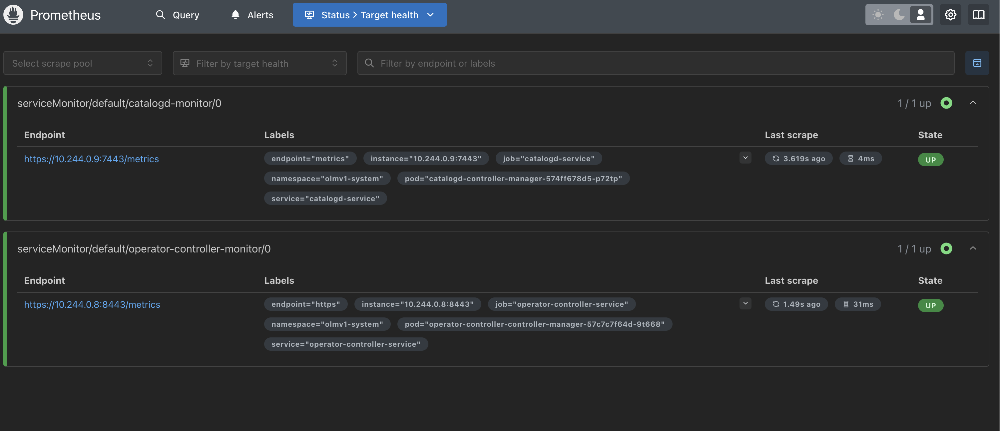

1. Start new kind-cluster with catalogd and op-con via `make run` target
    ```
    make run
    ```

2. Install Prometheus-Operator

    current namespace:
    ```
    LATEST=$(curl -s https://api.github.com/repos/prometheus-operator/prometheus-operator/releases/latest | jq -cr .tag_name)
    curl -sL https://github.com/prometheus-operator/prometheus-operator/releases/download/${LATEST}/bundle.yaml | kubectl create -f -
    ```

    custom namespace:
    ```
    NAMESPACE=my_namespace
    TMPDIR=$(mktemp -d)
    LATEST=$(curl -s https://api.github.com/repos/prometheus-operator/prometheus-operator/releases/latest | jq -cr .tag_name)
    curl -s "https://raw.githubusercontent.com/prometheus-operator/prometheus-operator/refs/tags/$LATEST/kustomization.yaml" > "$TMPDIR/kustomization.yaml"
    curl -s "https://raw.githubusercontent.com/prometheus-operator/prometheus-operator/refs/tags/$LATEST/bundle.yaml" > "$TMPDIR/bundle.yaml"
    (cd $TMPDIR && kustomize edit set namespace $NAMESPACE) && kubectl create -k "$TMPDIR"
    ```

3. Apply manifests from manifests/ in the order they are indexed

4. Expose Prometheus to local & verify Status>Target health in UI

    first do:
    ```
    kubectl port-forward prometheus-prometheus-0 9090:9090
    ```

    then navigate to http://localhost:9090/targets - both targets should be UP

    

5. cleanup

    ```
    make kind-clean
    ```
